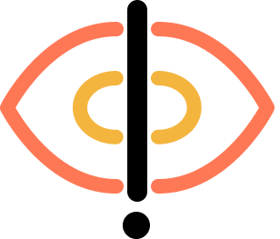

<div align="center">
  
  <h1>Oxyl - Sistema de Monitoreo de Sistemas</h1>

  <p>Sistema de monitoreo de infraestructura Linux — plug-and-play, escalable y sencillo</p>
</div>

## Compilación

> **Nota**: Para poder compilar el proyecto, es necesario tener instalado `make`, `golang`, `protoc` y estar en un entorno de desarrollo compatible (Linux) debido a que se requiere compilar dependencias las cuales dependientes de la arquitectura del sistema.

Para compilar el proyecto, ejecuta el siguiente comando:

```bash
make build
```

Todos los archivos se generarán en la carpeta `build/` de los correspondientes servicios.

### En caso de ser el frontend

Deberás dirigirte a la carpeta `frontend/` y en orden deberás:
1. Instalar las dependencias con `bun install`
2. Precopilar expo con `bun run prebuild`
3. Compilar el proyecto con `npx expo run:ios`

## Despliegue 

Esto aplica solamente para los servicios del backend. Los agentes deberán ser desplegados de forma individual en los sistemas que se deseen monitorear a través de la aplicacion.

1. Copiar el archivo `.env.example` a la ruta raíz de este proyecto y renombrarlo a `.env`
2. Rellenar los valores del archivo `.env`
3. Ejecutar `docker-compose up -d --build`
4. Si todo salió bien, los correspondientes servicios estarán disponibles en los puertos especificados en el archivo `docker-compose.yml`

